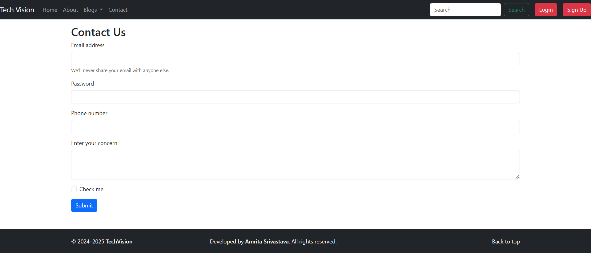

# TechVision - Responsive Blog Website

🔗 **Live Demo**: []()

TechVision is a clean and responsive blog-style website built using **HTML5** and **Bootstrap 5**, with minimal inline CSS. The project demonstrates effective use of Bootstrap's components and utility classes to build a modern and user-friendly interface.

This website includes structured sections such as **Home**, **About Us**, and **Contact Us**, along with key UI elements like a carousel, modal, contact form, and responsive navigation.

---

##  Features

- **Responsive Navbar**  
  Fully responsive Bootstrap-based navigation for seamless browsing across devices.

- **Hero Carousel**  
  An interactive Bootstrap carousel to highlight featured posts or images dynamically.

- **Interactive Modal**  
  Pop-up modal windows for displaying important alerts, updates, or extra information.

- **Contact Form**  
  A user-friendly form section where visitors can submit queries or feedback.

- **Clean Layout with Sections**  
  - **Home** – Engaging landing section.
  - **About Us** – Overview of the blog's mission and background.
  - **Contact Us** – Input form for user communication.

- **Stylish Footer**  
  Includes back-to-top functionality and essential links.

- **UI Elements**  
  Buttons, cards, and spacing utilities implemented using Bootstrap only.

---

##  Technologies Used

- **HTML5** – Semantic and well-structured markup.  
- **Bootstrap 5** – For layout, responsiveness, and prebuilt UI components.  
- **Inline CSS** – Very limited usage for quick styling adjustments.

---

##  Screenshots




---

## How to Contribute

Contributions are always welcome! Follow these steps to get started:

1. Fork the repository.
2. Create a new feature branch:
   ```bash
   git checkout -b feature/my-feature
3. Commit your changes:
   ```bash
   git commit -m "Add feature"
   ```
4. Push to the branch:
   ```bash
   git push origin feature-name
   ```
5. Open a pull request.

## Contact
For any queries or suggestions, feel free to reach out:
- **GitHub**: [https://github.com/Amritasri10](https://github.com/Amritasri10)